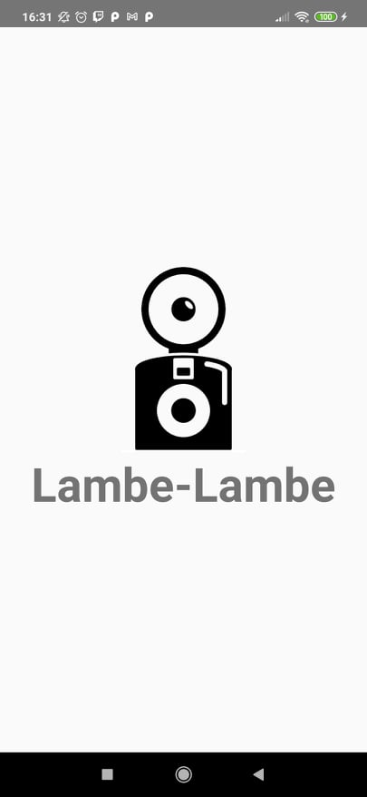
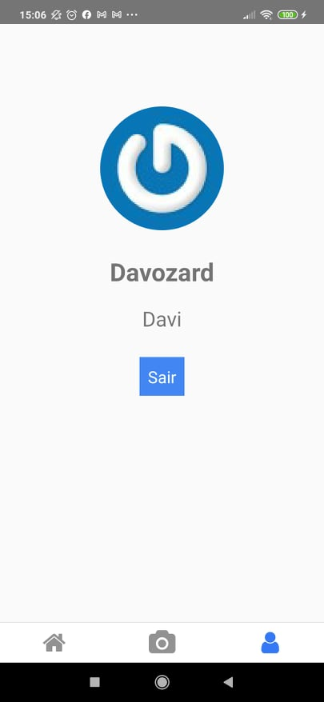
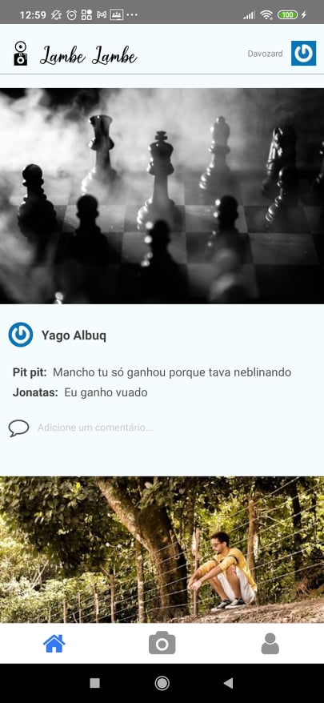
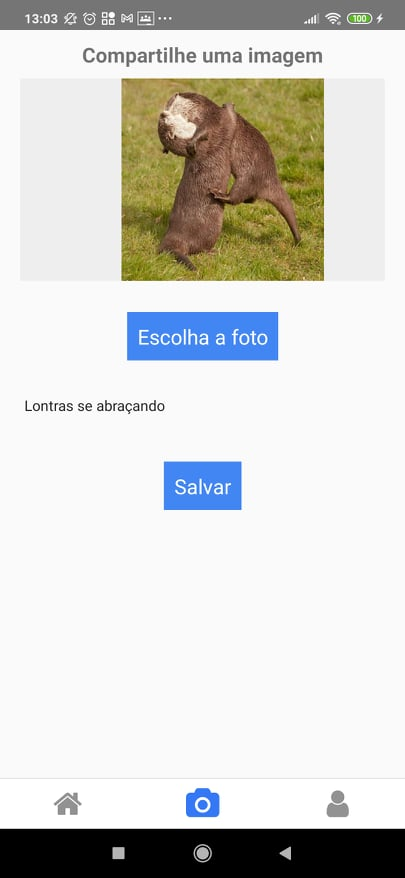
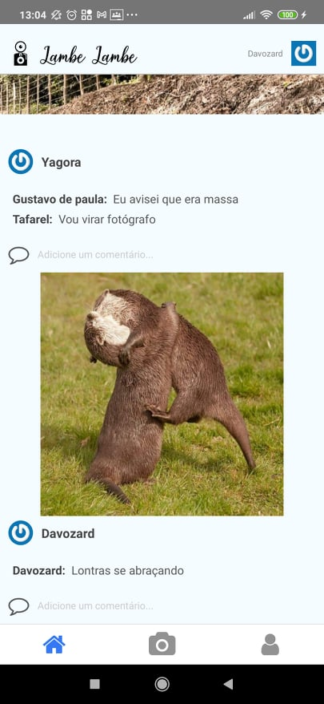

# Lambe Lambe

  
  
  
  
  

> Projeto de clone do instagram usando o Firebase para storage e upload das fotos, database e autenticação, com três menu tabs, login e registro, compartilhamento de imagem da câmera ou do aparelho e feed de fotos com comentários, projeto feito pela Cod3r.
