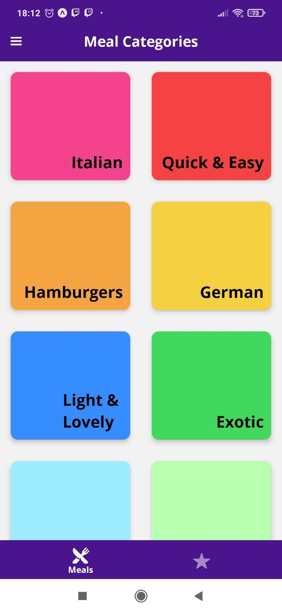
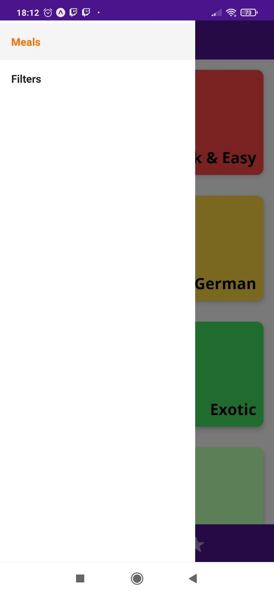
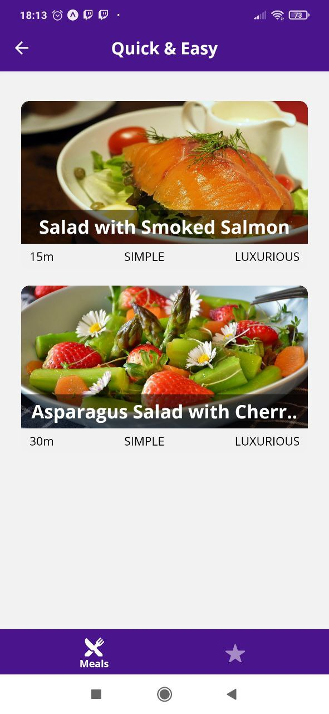
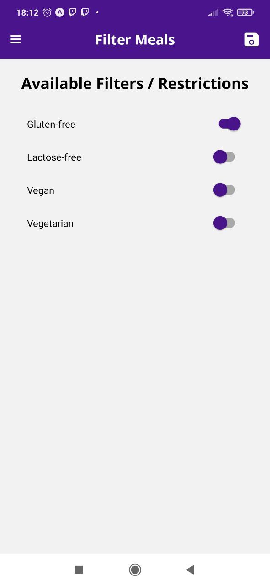
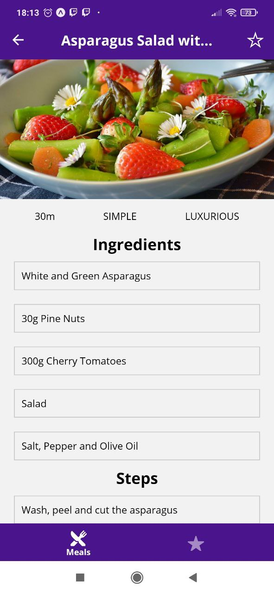
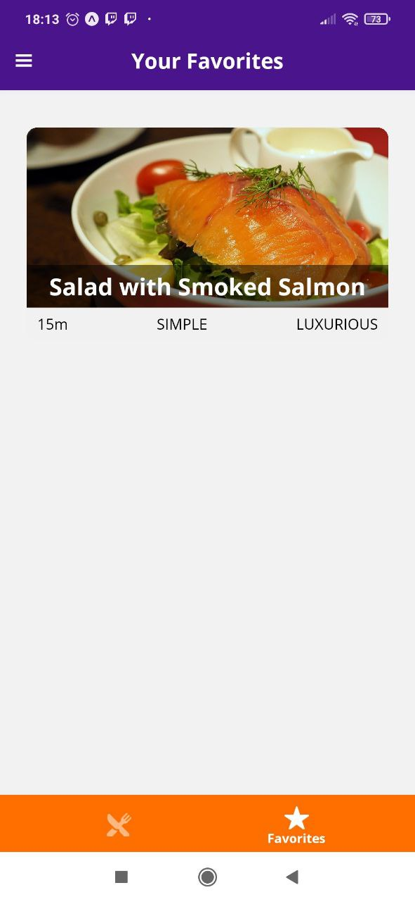

# Meals App

  
  
  
  
  
  

> Projeto mais robusto usando Expo, de um aplicativo com dados de exemplo para receitas, podendo filtrar as receitas baseadas em características e podendo favoritar a receita, foram utilizados react navigation, stack, drawer, bottom tab, redux, projeto feito por Maximilian Schwarzmüller.
