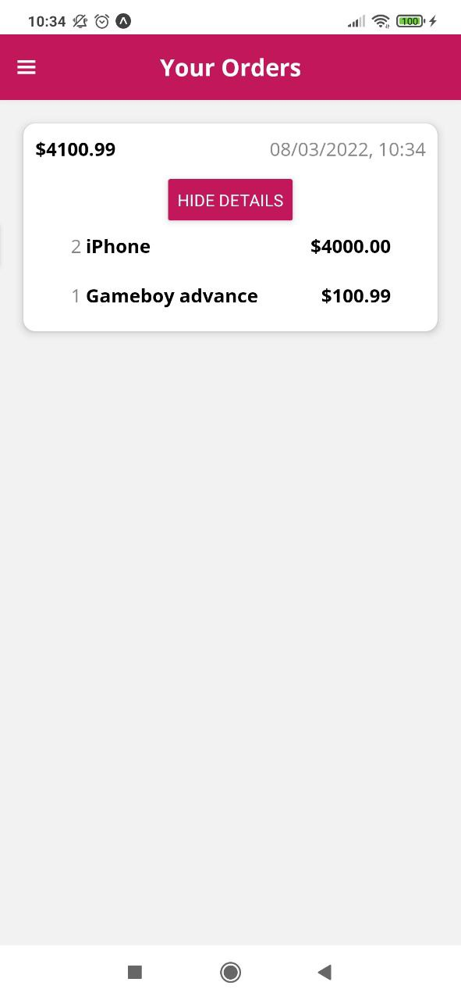

# Shop App

  
  
  
  
  
  
  
  
  
  
  
  
  
  

> Projeto mais robusto usando Expo, de um aplicativo com dados hospedados no servidor e base de dados do Firebase, sendo necessário realizar o Log in ou Sign up, com token de autenticação armazenado localmente pelo AsyncStorage, podendo adicionar produtos, editar, deletar, adicioná-los ao carrinho, fechar o pedido, os produtos são relacionados com a autenticação do usuário pelo Firebase, com gerenciamento de estados usando Redux, validação de Inputs, react navigation, stack, drawer, switch, projeto feito por Maximilian Schwarzmüller.
