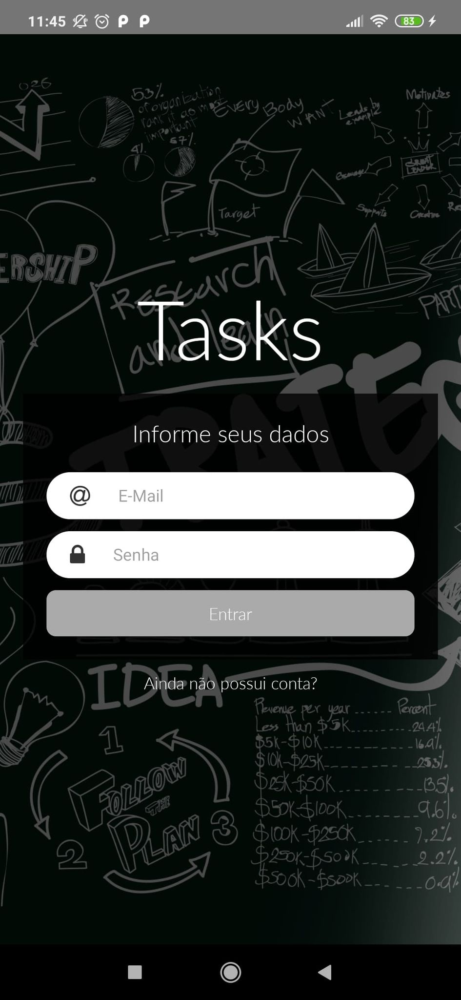
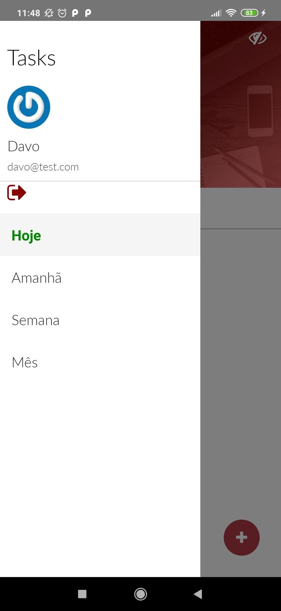
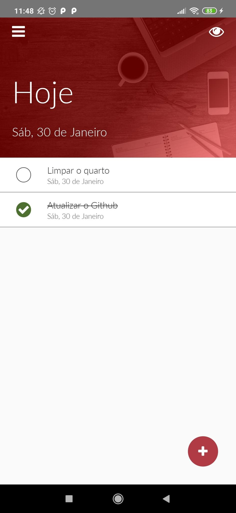
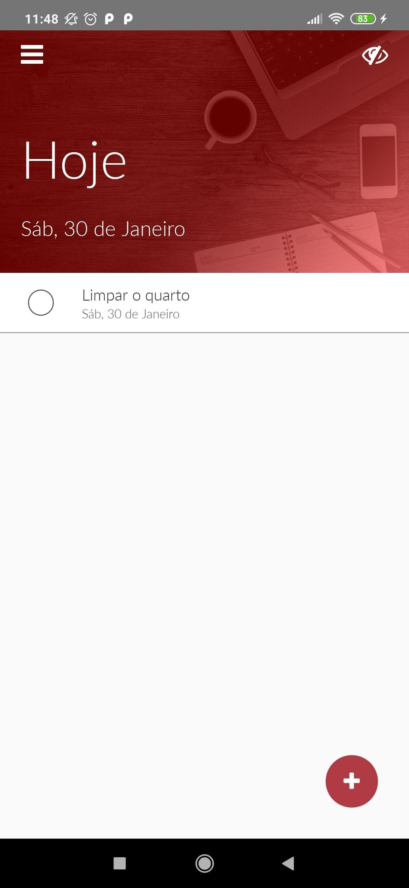
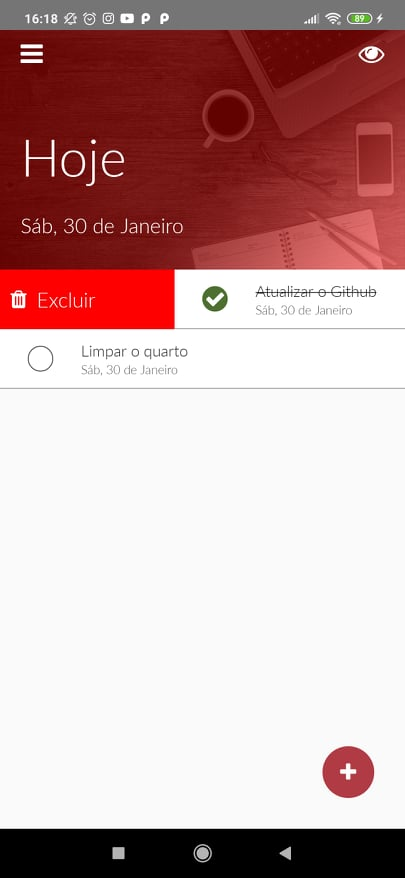
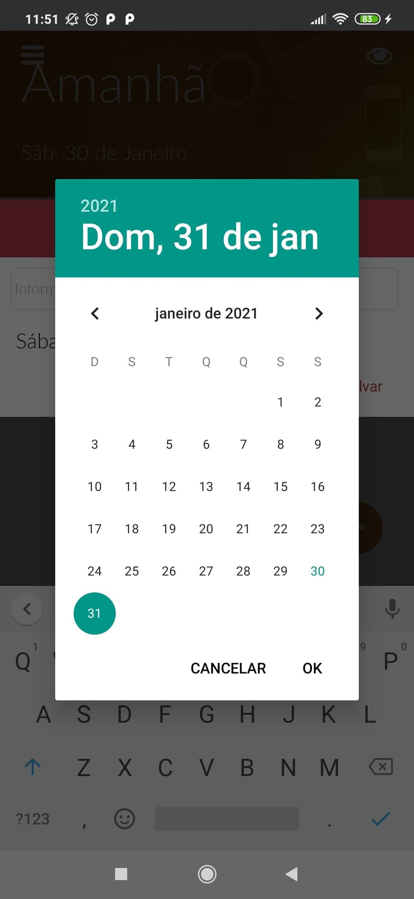
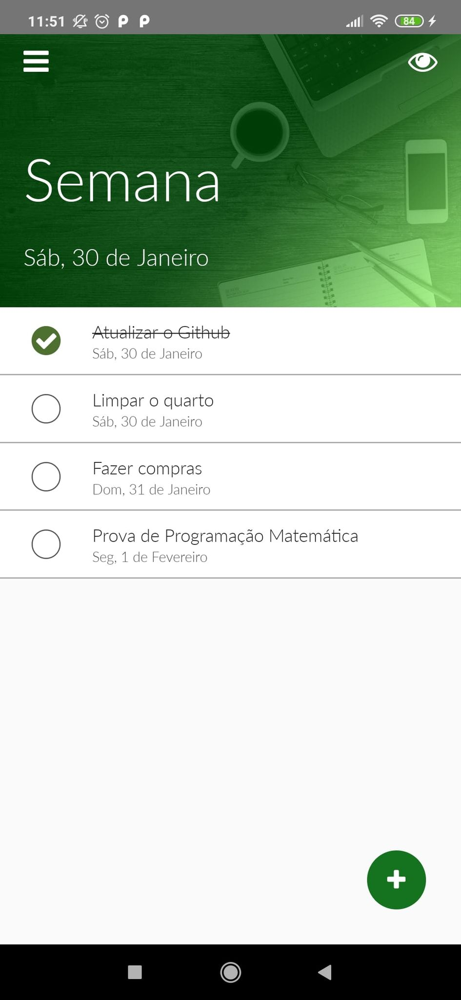
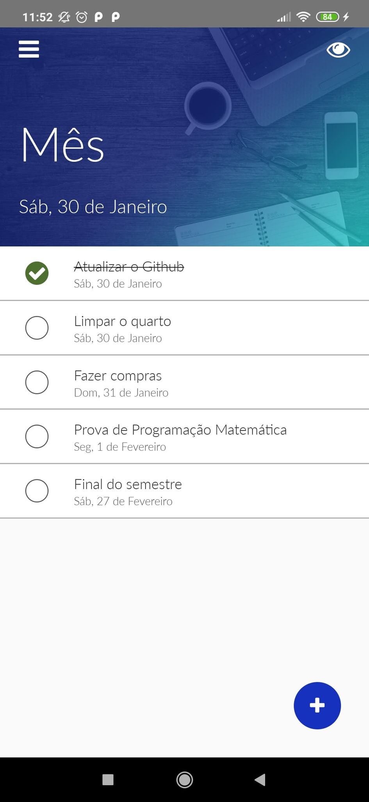

# Tasks

  
  
  
  
  
  
  
  

> Projeto usando uma API local com PostGresSQL relacional entre usuários e tarefas, Knex e autenticação, uma aplicação que enumera tarefas (tasks), com modal para input de datas, descrição da atividade, menu lateral para logout e separar as tarefas por dia, semana, mês, login e signin e filtro para listar as atividades feitas e pendentes, e um swipeable para deletar as tarefas, projeto feito pela Cod3r.
